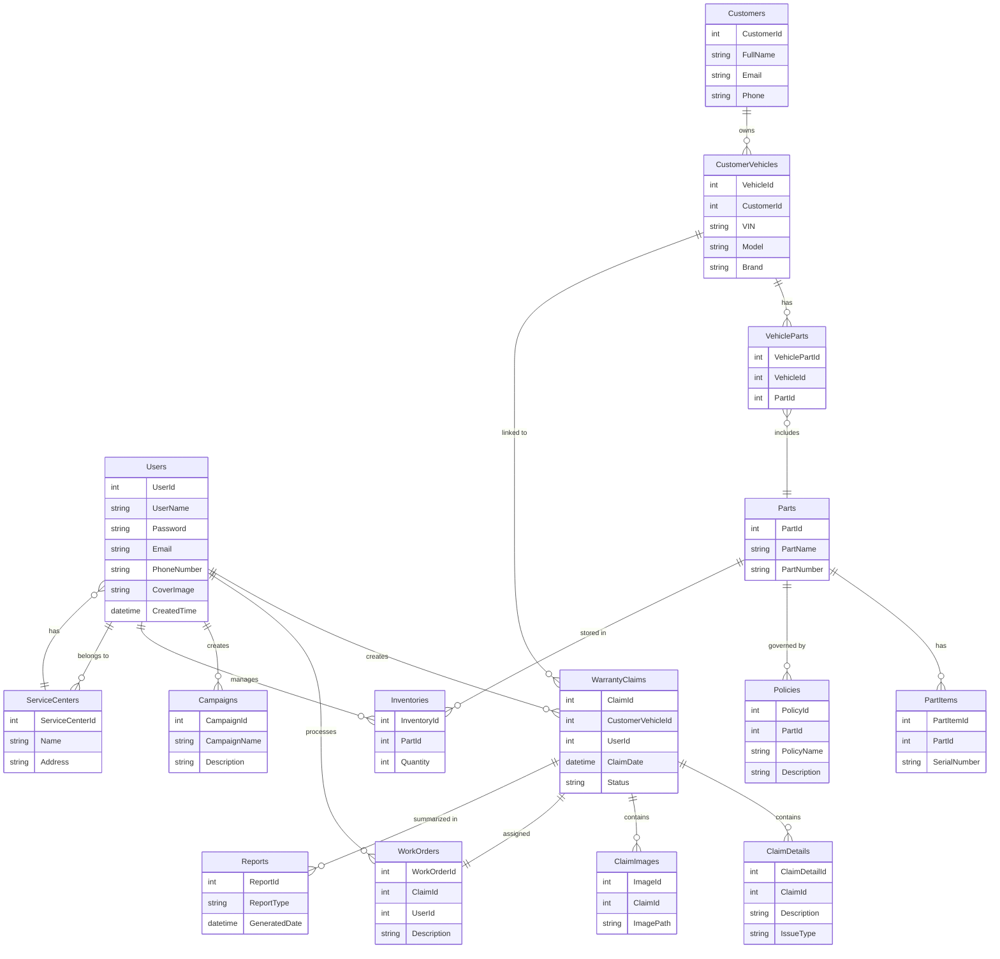

# 🗄️ Database

## Database Design

## Entity Relation Diagram

```mermaid
erDiagram
    %% === Core Entities ===
    Users {
        int UserId
        string UserName
        string Password
        string Email
        string PhoneNumber
        string CoverImage
        datetime CreatedTime
    }

    ServiceCenters {
        int ServiceCenterId
        string Name
        string Address
    }

    WarrantyClaims {
        int ClaimId
        int CustomerVehicleId
        int UserId
        datetime ClaimDate
        string Status
    }

    ClaimDetails {
        int ClaimDetailId
        int ClaimId
        string Description
        string IssueType
    }

    ClaimImages {
        int ImageId
        int ClaimId
        string ImagePath
    }

    Customers {
        int CustomerId
        string FullName
        string Email
        string Phone
    }

    CustomerVehicles {
        int VehicleId
        int CustomerId
        string VIN
        string Model
        string Brand
    }

    VehicleParts {
        int VehiclePartId
        int VehicleId
        int PartId
    }

    Parts {
        int PartId
        string PartName
        string PartNumber
    }

    PartItems {
        int PartItemId
        int PartId
        string SerialNumber
    }

    WorkOrders {
        int WorkOrderId
        int ClaimId
        int UserId
        string Description
    }

    Inventories {
        int InventoryId
        int PartId
        int Quantity
    }

    Policies {
        int PolicyId
        int PartId
        string PolicyName
        string Description
    }

    Campaigns {
        int CampaignId
        string CampaignName
        string Description
    }

    Reports {
        int ReportId
        string ReportType
        datetime GeneratedDate
    }

    %% === Relationships ===
    Users ||--o{ WarrantyClaims : "creates"
    Users ||--o{ WorkOrders : "processes"
    Users ||--o{ Campaigns : "creates"
    Users ||--o{ Inventories : "manages"
    Users ||--o{ ServiceCenters : "belongs to"

    ServiceCenters ||--o{ Users : "has"
    Customers ||--o{ CustomerVehicles : "owns"
    CustomerVehicles ||--o{ VehicleParts : "has"
    CustomerVehicles ||--o{ WarrantyClaims : "linked to"

    WarrantyClaims ||--o{ ClaimDetails : "contains"
    WarrantyClaims ||--o{ ClaimImages : "contains"
    WarrantyClaims ||--|| WorkOrders : "assigned"
    WarrantyClaims ||--o{ Reports : "summarized in"

    Parts ||--o{ PartItems : "has"
    Parts ||--o{ Policies : "governed by"
    Parts ||--o{ Inventories : "stored in"
    VehicleParts }o--|| Parts : "includes"
```