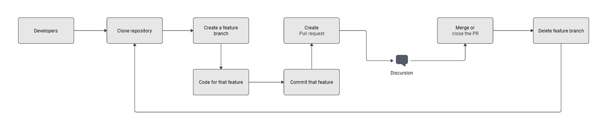

# 📑 Warranty Management System

We'll cover the following
+ [🎯 Project Overview & Goals](#🎯-project-overview-goals)
+ [🧑‍💻 Team Roles & Responsibilities](#🧑‍💻-team-roles-responsibilities)
+ [ 🛠️Technology Stack](#🛠️-technology-stack)
+ [🏗️ System Architecture](#🏗️-system-architecture)
+ [🌊 Warranty Workflow](#🌊-warranty-workflow)
+ [🎨 Database Design](#🎨-database-design)
+ [📚 Document References](#📚-document-references)

## 🎯 Project Overview & Goals
ELV Warranty Management System helps local service staff handle warranty requests efficiently and transparently. It allows them to record customer issues, verify warranty eligibility, and submit claims directly to the manufacturer. The system tracks the status of each request—from submission and inspection to approval and replacement—ensuring quick resolution and accurate documentation. By digitizing the entire process, local staff can reduce paperwork, improve communication with the manufacturer, and deliver faster, more reliable service to customers.

Goal:
+ Digitize the warranty workflow to reduce manual paperwork.
+ Improve response time for warranty approvals.
+ Provide transparency for both service centers and the manufacturer.


## 🧑‍💻 Team Roles & Responsibilities
### Team Structure
| Role              | Name / Placeholder |
| ------------------|:------------------:|
| Back-End Dev      | Nguyễn Phước Thịnh |
| Back-End Dev      | Trương Minh Nhật   |
| Front-End Dev     | Nguyễn Việt Hùng   |
| Front-End Dev     | Phạm Minh Ánh      |
| Front-End Dev     | Hồ Tú Minh Triều   |

### Github Workflow


## 🛠️ Technology Stack
### Backend
+ .NET 8.0 - Main Framework
+ ASP.NET Core - Web API framework
+ Entity Framework Core - ORM
+ Auto Mapper - Dependency Injection
+ NPGSQL - .NET data provider for PostgreSQL
+ BCrypt.NET - Securely hashing and Verifying passwords
+ Postgres - Database
+ JWT Authentication - Security
+ Postman - API documentation

### Frontend
+ React 19 - UI library
+ Vite - Build tool
+ React Router DOM - URL Mangement
+ Shadcn - Components UI
+ Phosphoricons - Icons library

### DevOps
+ Docker - Containerization
+ Kubernetes - Container Orchestration
+ Nginx Proxy Manager - Reverse proxy
+ SonarQube - Code quality & Security reviews
+ Trivy - Vulnerability scanner for containers
+ Jenkins - Continuous Integration
+ ArgoCD - Continuous Delivery

## 🏗️ System Architecture
```
[ Frontend (React) ]
   ↓ REST API calls
[ Backend (ASP.NET Core WebAPI) ]
   ↓
[ Database (PostgreSQL) ]
   ↓
[ File Storage (Local / S3 / MinIO) ]
```

## 🌊 Warranty Workflow
1. Local Staff logs a new warranty claim → fills in customer, vehicle, and defect details.
2. Backend validates claim, assigns claim ID, stores data, and uploads related files.
3. Manufacturer Reviewer checks eligibility and approves/rejects the request.
4. System updates claim status and notifies the local staff.
Service Center receives replacement parts or reimbursement.

## 🎨 Database Design
Our system will have total 15 Entities:

+ Users: User management and authorization
+ Customer: Customer information
+ CustomerVehicle: Customer vehicle information
+ Campaign: A voluntary, non-safety-related action, often for a technical update or a less serious issue. 
+ CampaignType: Recall/Service
+ ServiceCenter: A service center have many users
+ WarrantyPolicy: Warranty policy for each part
+ WarrantyClaim: Received claim vehicles
+ Report: A Claim/Campaign report
+ ReportType: Type of warranty report
+ WorkOrder: Tasks information for SC Technician
+ VehicleParts: Parts from customer vehicle
+ PartItem: Parts detail information
+ Parts: Parts information
+ Inventory: Parts management

## 📚 Document References
### DevOps & Deployment
+ [🚀 CI/CD Pipeline](CICD.md)
### Project Documentation
+ [⚙️ Project Main Flow](MAIN_FLOW.md)
+ [📰 Features](FEATURE.MD)
+ [🗄️ Database Overview](DATABASE.md)

