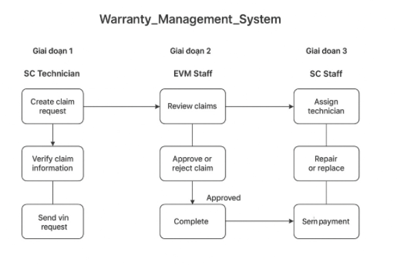
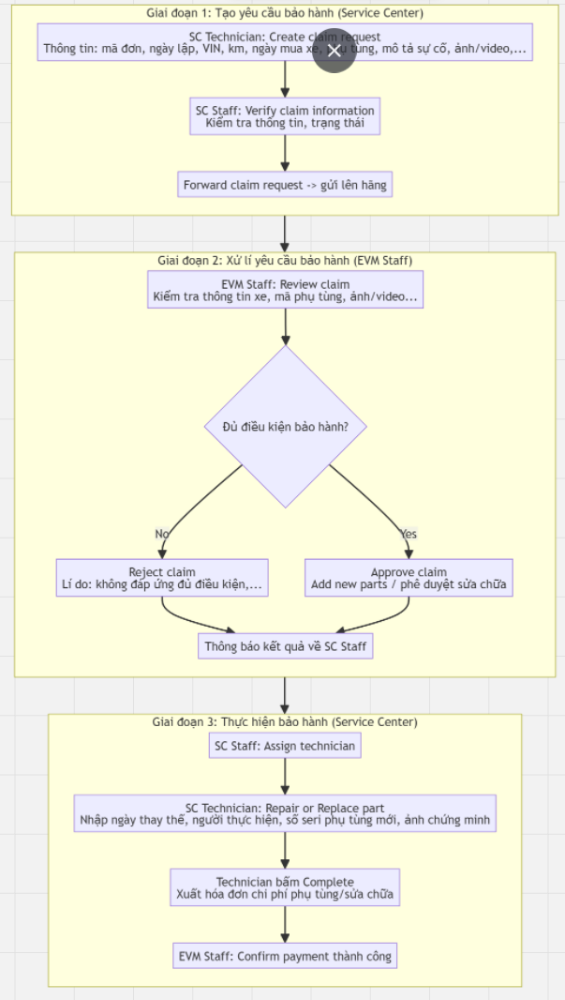
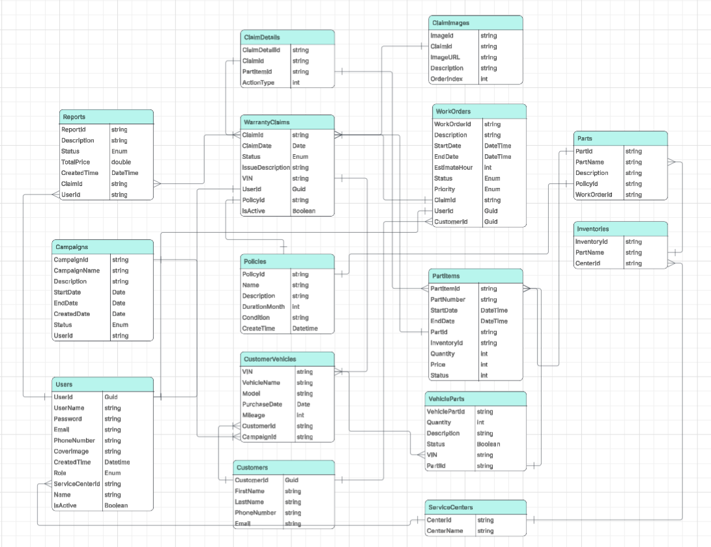

# 📑 Warranty Management System

We'll cover the following
+ [Main Flow](#main-flow)
+ [System Requirement](#system-requirement)
+ [Flow Diagram](#flow-diagram)
+ [Database Design](#database-design)
+ [CI/CD Flow](#cicd-flow)

## Main Flow
### 🟢 Luồng 1: Bảo hành xe
#### 🔹 Giai đoạn 1: Tạo yêu cầu bảo hành (Service Center)
**👨‍🔧 SC Technician**
+ Tạo mới một yêu cầu bảo hành (Claim Request).
+ Thông tin bao gồm:
    + 📌 Mã lập đơn, Ngày lập đơn, Trung tâm, Người lập
    + 🚗 Hãng xe, Mã VIN, Số km, Ngày mua xe
    + 🔧 Tên & mã phụ tùng, Ngày thay thế
    + 📝 Mô tả sự cố, điều kiện vận hành
    + 📷 Ảnh/Video minh chứng
    + 📨 Yêu cầu từ trung tâm:
        + Cung cấp phụ tùng thay thế / phê duyệt sửa chữa
        + Hoàn chi phí sửa chữa (nếu trung tâm đã thay trước)

**👩‍💼 SC Staff**
+ Nhận claim mới → xem danh sách claim (theo ngày, trạng thái).
+ 🔍 Xác minh lại thông tin.
+ 📤 Gửi claim lên hãng (EVM Staff).

#### 🔹 Giai đoạn 2: Xử lý yêu cầu bảo hành (EVM Staff)

**👨‍💼 EVM Staff**
+ Mở claim request → kiểm tra thông tin: xe, phụ tùng, ảnh/video...
+ ⏳ Đánh giá thời hạn & điều kiện bảo hành.

**🛑 Nếu không đạt → Reject claim**
+ Lý do: phụ tùng hết hạn, hư hỏng do người dùng, v.v.
+ 📩 Trả lại thông báo cho SC Staff.

**✅ Nếu đạt → Approve claim**
+ Cung cấp phụ tùng / phê duyệt sửa chữa.
+ 📩 Gửi thông báo approved về SC Staff.

#### 🔹 Giai đoạn 3: Thực hiện bảo hành (Service Center)
**👩‍💼 SC Staff**
+ Assign cho một Technician để thực hiện case.

**👨‍🔧 SC Technician**
+ Thay thế hoặc sửa chữa phụ tùng.
+ Ghi nhận: Ngày thay thế, Người thực hiện, Ảnh chứng minh, Số seri phụ tùng mới.
+ 🖱️ Bấm Complete → xuất hóa đơn bảo hành (chi phí dựa trên phụ tùng/sửa chữa).

**🏢 EVM Staff**
+ Nhận hóa đơn.
+ 💳 Bấm Thanh toán (chỉ hiển thị “Thanh toán thành công”).

### 🟡 Luồng 2: Chiến dịch (Service Campaign / Recall)
#### 📝 Giai đoạn Khởi tạo & Phê duyệt (Manufacturer)
+ Hãng xác định vấn đề kỹ thuật/an toàn.
+ Tạo chiến dịch:
    + 🔖 Loại: Service Campaign hoặc Safety Recall.
    + 📜 Mô tả chi tiết, biện pháp khắc phục.
    + ⏰ Thời gian hiệu lực.
    + 🧩 Linh kiện/Phần mềm liên quan.
+ 👨‍💼 Quản lý hãng phê duyệt → hệ thống kích hoạt:
    + Đánh dấu các xe bị ảnh hưởng = Campaign Pending.
    + 📩 Gửi thông báo đến Service Center.

#### 🛠️ Giai đoạn Triển khai (Service Center)
+ Nhận thông tin chiến dịch.
+ Kiểm tra kho phụ tùng → đặt hàng nếu cần.
+ Lập lịch dịch vụ cho khách hàng:
    + Nhập VIN → hệ thống báo xe có nằm trong campaign không.
    + Lên lịch hẹn & thông báo khách.
+ Khi xe tới:
    + Tạo Repair/Warranty Order (RO/WO).
    + Gán mã chiến dịch.
    + 👨‍🔧 Technician thực hiện công việc (thay linh kiện, update phần mềm).
    + Ghi lại thời gian & phụ tùng đã sử dụng.
+ Sau khi xong:
    + Đóng RO/WO → gửi claim bồi thường đến hãng.
+ Hệ thống tự động cập nhật:
    + 🚘 VIN = Campaign Completed / Claim Submitted.
    + 📅 Lưu ngày & trung tâm thực hiện.

## System Requirement
We will focus on the following set of requirements while designing:
#### Main Function
##### For SC Technican:
1. SC Technican should be able to login into system.
2. SC Technican should be able to reset password by send a  request password change to admin
3. SC Technican should be able to create a claim request.
4. SC Technican should be able to see list of created claim request.
5. SC Technican should be able to edit a created claim request (can edit if the status is pending).
6. SC Technican should be able to see all work orders.
7. SC Technican should be able to list work orders by status (Pending, In Progress, Completed, Overdue). 
8. SC Techincian should be able to list work by by priority (High, Medium, Low).
9. SC Technician should be able to search work orders by orderID/VehicleName
10. SC Techician should be able to see no result model if no search result found
11. SC Technicican should be able to see details of a work order (Vehicle information, Customer information, Issue Details, Work Details, Schedule, Actions)
12. SC Technician should be able to set action of an work detail (Start working, Complete work)
13. SC Techician should be able to see their basic profile information

##### For SC Staff:
1. SC Staff should be able to login into system.
2. SC Staff should be able to reset password by sending a request password change to admin
3. SC Staff should be able to review claim requests.
4. SC Staff should be able to view all claim requests.
5. SC Staff should be able to view all technicians in the system with their work status.
6. SC Staff should be able to assign workers to do the work ordered.
7. SC Staff should be able to view the monthly costs for the services in the center.
8. SC Staff should be able to view their profile.
9. SC Staff should be able to view a list of warranty report.

##### For EVM Staff:
1. EVM Staff should be able to login into system.
2. EVM Staff should be able to reset password by sending a request password change to admin.

## Flow Diagram

## Database Design
Our system will have total 14 tables:

+ SystemUser
+ CustomerDetail
+ CustomerVehicle
+ Campaign
+ CampaignType
+ WarrantyPolicy
+ WarrantyClaim
+ Report
+ WarrantyRepair
+ VehicleType
+ Suppliers
+ Parts
+ PartSuppliers
+ VehicleParts

## CI/CD Flow
